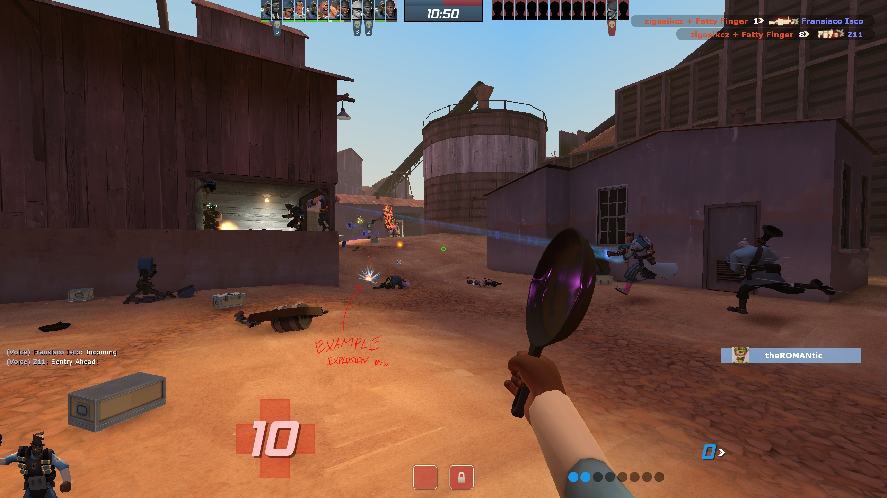

# TF2 Ambro Configs
This is a collection of scripts that I use to play Team Fortress 2! It contains many useful scripts and also graphic changes - they are performance friendly but still keep look which I really like - everything is in autoexec.cfg file.

===

===

===

# Features
Generally, there are some useful scripts for different classes, but also scripts like crouch-jump (if you press and hold space, you jump and crouch until the release of space) and many more. Here is the list. MORE INFORMATION BELOW, EVERYTHING IS EXPLAINED.
- **Scripts FOR ALL classes**, e.g. `r` to change model visibility
- **Scripts BASED ON class**, e.g. rocket jump script only on soldier
- **Null movement script**
- **Crouch-jump**
- **Quick respawn bind**
- **Pyro panic button**
- **Heavy barrel spin click**
- **Engineer quick build and eureka effect**
- **Medic health radar and auto medigun**
- **Sniper zoom sensitivity changer**
- **Viewmodel fov changer**
- **Viewmodel visiblity changer**
- **Better scoreboard**
- **Zoom bind**

---

- **Adjusted graphic look**, it contains both pretty well performance and look *(all these options are in autoexec.cfg)*
- **Custom HUD**, I just used modified version of **ToonHUD** created by Delfy *(https://toonhud.com/user/ambro/theme/G0ZQ3LPW)*
- **Hidden first person pyro flames**, yeah by simple trick you can do it *(to disable it locate custom/classes_configs/pyro.cfg and change viewmodel_fov 1 to something else e.g. 90)*
- **Custom hit and kill sounds**, cool sounds by Delfy *(couldn't find the source)*
- **Less distracting Explosions**, much better view when playing Soldier or Demoman - it changes explosion particles to a small and subtle particle.
- **Disabled pyroland**, just to get rid of the fancy look when you have equipped the glasses that bring this land  *(you can always disable it by not importing `mastercomfig-disable-pyroland-addon.vpk` file to custom folder)*
- **Flat mouse**, probably just some scripts that ensure you use raw sensitivity *(it's named `mastercomfig-flat-mouse-addon.vpk` inside custom folder)*
- **No footsteps**, sound is just removed *(can be ignored as well, just don't import `mastercomfig-no-footsteps-addon.vpk`to custom folder)*
- **No tutorial**, it disables tutorial messages and other popups.
- **Medbeam fix**, a better VFX of the beam *(look credits for source)*
- **Gibs removal**, gibs are removed when ragdolls are enabled *(you can mess around this inside autoexec.cfg - comments are left so you should find it easily)*
- **Performance friendly launch options**

# Scripts for ALL classes
All these scripts are located in autoexec.cfg - cfg folder
- **Null movement**
- **Viewmodel fov changer**, binded to `h`, toggles fov between 90 and 110
- **Viewmodel visiblity changer**, binded to `v`, toggles visiblity
- **Min viewmodel changer**, binded to `j`, toggles visiblity
- **Better scoreboard**, binded to `tab`, when held you see net_graph information as well
- **Zoom bind**, it's **not enabled** - changes yor fov from 90 to lowest value *(it's commented, so uncomment it and make sure to set bind to some correct one, search for //zoom script in autoexec.cfg)*
- **My crosshair**, it's **not enabled** as well, so you need to either copy commands or uncommend it *(search for //crosshair in autoexec.cfg)*

# Scripts BASED ON class
All these scripts are located in classes_configs folder - custom folder
- **ALL CLASSES**
  - **Crouch-jump**, every class has this script in which if you press and hold space you jump and crouch until release of space, pretty cool.
  - **Respawn bind**, press `mouse5` to respawn with first loadout.
- **Scout**
  - **Winger jump sync (experimental and must be uncommented in files** `C:\Program Files (x86)\Steam\steamapps\common\Team Fortress 2\tf\custom\classes_configs\cfg\scout.cfg`**)** Probably bugged when you change to different class (probably you just need to unbind space, or bind it to +jump) Generally I rarely play as scout but found this cool script.
- **Soldier**
  - **Rocket jump**, binded to `mouse4` - just right click, it jumps and crouches at the same time so you sync jump pretty well, however you can just hold space and effects is same.
- **Pyro**
  - **Panic button**, which is binded to `mouse4`, when you **hold** it, you attack and spin like crazy.
  - **Hidden first person pyro flames**, simply by viewmodel set to 1 when first weapon - flame thrower is selected.
- **Heavy**
  - **Barrel spin click**, binded to `mouse2`, right click to automatically crouch-jump and start to spin barrel.
- **Engineer**
  - **Quick build**, press bind so you destroy and build object: `mouse4` -  Sentry, `mouse5` - Dispenser, `4` - Teleport Entrance, `5`, Teleport Exit.
  - **Quick eureka effect**, press `ctrl+c` to teleport to the base, press ``ctrl+v`` to teleport to the teleporter exit.
  - **Respawn bind** (it's different compared to every other class, use `mouse3` instead of `mouse5`) press `mouse3` to respawn with first loadout (Used when you build something in base, just press q to respawn and get instantly metal instead of walking for it - generally pressing q is faster)
  - **PDA Removal**, build and exit PDA is not binded so you cannot use it in game (you can always uncommend part above to get these binds on 6 and 7 key)
- **Medic**
  - **Health radar**, press `mouse4` to see health icon above nearby teammates.
- **Sniper**
  - **Zoom sensitivity changer**, currently you can toggle sensitivity between 0.8 and 0.4 by ``mouse4``, but you can always uncomment part below and make this sensitivity value change when you **HOLD** button. I personally prefer toggle option which is enabled by default.
- **Spy**
  - **Last Disguise**, basically it's normal game feature LOL, but binded to `mouse4`.

# Possible issues
- **Sniper zoom ratio doesn't want to save when you use e.g ``zoom_sensitivity_ratio 0.75`` in console**
  - This is because the scripts set this value and override your value from console. To set ratio you want to need to change it inside `classes_configs` and ``sniper.cfg`` file. Just change 0.8 to value you want and 0.4 to let's say `value you want / 2` so it will reduce sensitivity by half when you change it by bind, makes sense I think.
- **Crashes when you load into server and ALT-TAB and have game in background**
  - Generally I have no idea what causes it so I just recommend stay during loading time until you get into the game or if you really want to do something in background make sure you wont see loading screen in game, just skip it until you get into the game - icon should blink on bottom of taskbar

# Installation
There shouldn't be any issues during this process, it's really easy however if you would face some issues, please search answer on internet, chances that I will replay to you are near zero.
- **CONFIGS**
  - For `custom` navigate to `C:\Program Files (x86)\Steam\steamapps\common\Team Fortress 2\tf\custom` and paste here all files.
  - For `cfg` navigate to `C:\Program Files (x86)\Steam\steamapps\common\Team Fortress 2\tf\cfg` and paste here only autoexec.cfg if you want all stuff from here. Or also with config.cfg to replace the binds from the game and use my
- **MAPS**
  - Navigate to `C:\Program Files (x86)\Steam\steamapps\common\Team Fortress 2\tf\maps` and paste here .bsp file. Generally you can check this [simple tutorial](https://youtu.be/Y8on-6xguJ4)
- **LAUNCH OPTIONS**
  - `-novid -nojoy -nosteamcontroller -threads 8 -nosteamcontroller -nohltv -particles 1 -precachefontchars -noquicktime`
  - Simply open Steam and in library page right click tf2, click properties and inside general tab (should be selected by default) you should find `launch options`. Paste here text from above (only parametr I would suggest to check is threads - make sure you set here correct value)

# Credits
Generally there is a lot of stuff from the interenet, however in most cases it's described inside files, but I will provide some information.

- ToonHUD that I used is based on Delfy's hud created on https://toonhud.com. Here is link for hud that I use https://toonhud.com/user/ambro/theme/G0ZQ3LPW
- Medbeam fix https://gamebanana.com/mods/437447
- Masterconfig https://comfig.app (for more advanced .vpk scripts inside custom folder)
- Walkway map https://gamebanana.com/mods/74812

# Extra sources
List of useful sources that I used. Might be useful for you as well.

- https://github.com/Lyrositor/TF2-Scripts
- Launch options explanation https://docs.comfig.app/latest/customization/launch_options
- Most of the scripts I used probably are from here https://gamebanana.com/games/297
- New Knife Inspect Animation (I just left it here to remember that I need to test it and possibly use someday lol) https://gamebanana.com/mods/591988

- Great video about tf2 HUD visual clarity https://youtu.be/orWzoxnjXM4

# Random note
Whenever your game has random high pitch and you hear that audio is cracked, then try to set tf_dingaling_pitchmindmg and tf_dingaling_pitchmaxdmg to 100. These commands helped me!
